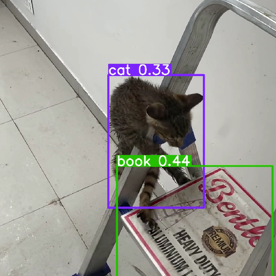

# 🎥 AI Video Analyzer: YOLOv8 + MediaPipe Pose Estimation

A Python project that combines **real-time object detection** using **YOLOv8** and **human pose estimation** using **MediaPipe** to analyze and annotate videos frame-by-frame. The final output is a processed video with both bounding boxes and pose landmarks overlaid.

---

## 📽️ Demo


> Example:  
> 

---

## 🔧 Features

- ✅ Object detection using **YOLOv8**
- ✅ Human pose estimation using **MediaPipe Pose**
- ✅ Combined overlay on each frame
- ✅ Annotated output video saved locally
- ✅ Clean and modular Python code

---

## 🛠️ Technologies Used

- [Python](https://www.python.org/)
- [OpenCV](https://opencv.org/) – for video reading/writing and drawing
- [MediaPipe](https://google.github.io/mediapipe/) – for human pose estimation
- [Ultralytics YOLOv8](https://github.com/ultralytics/ultralytics) – for object detection
- `yolov8n.pt` model – lightweight version for real-time use

---

## 📁 Project Structure
touch_design_proj/
- ├── main.py # Main script for video processing
- ├── download_model.py # Optional: Preloads the YOLO model
- ├── your_video.mp4 # Input video (not uploaded to GitHub)
- ├── output_yolo_pose.mp4 # Output video with annotations
- ├── requirements.txt # Python dependencies
- ├── .gitignore # To exclude venv, videos, cache, etc.
- └── README.md # This file


---

## 🚀 Getting Started

### 1. Clone the repository

```
git clone https://github.com/MEHULSHARMA26/yolo-mediapipe-video-analyzer.git
cd yolo-mediapipe-video-analyzer 
```

### 2. Setting Up Environment
Run in Terminal
```
python -m venv venv
venv\Scripts\activate  ( Windows )
### or
source venv/bin/activate (macOS/Linux)

```

### 3. Install dependencies
```
pip install -r requirements.txt

```
Or manually:
```
pip install opencv-python mediapipe ultralytics

```

### 4. Add input video
Place your video file (.mp4 or .mov) in the project folder and update this line in main.py:

python
```
input_video = r"your_video.mp4"

```
### 5. Run the script
```
python main.py

```

## 📦 Output
After processing, the script generates:

🟩 Bounding boxes from YOLOv8

🦴 Skeleton landmarks from MediaPipe Pose

🎞️ Final video saved as output_yolo_pose.mp4
